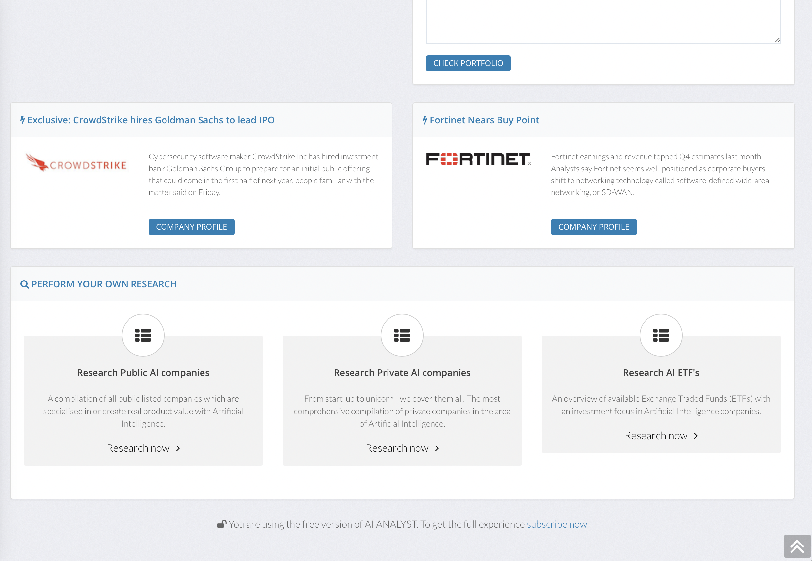
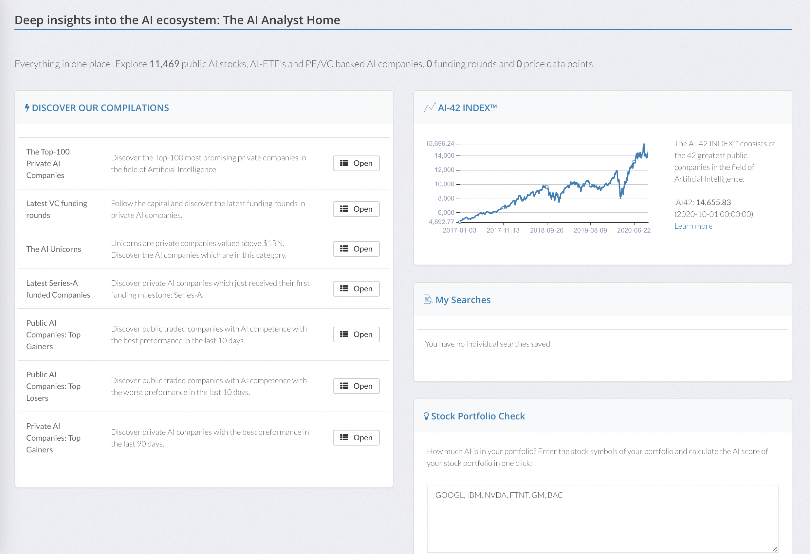
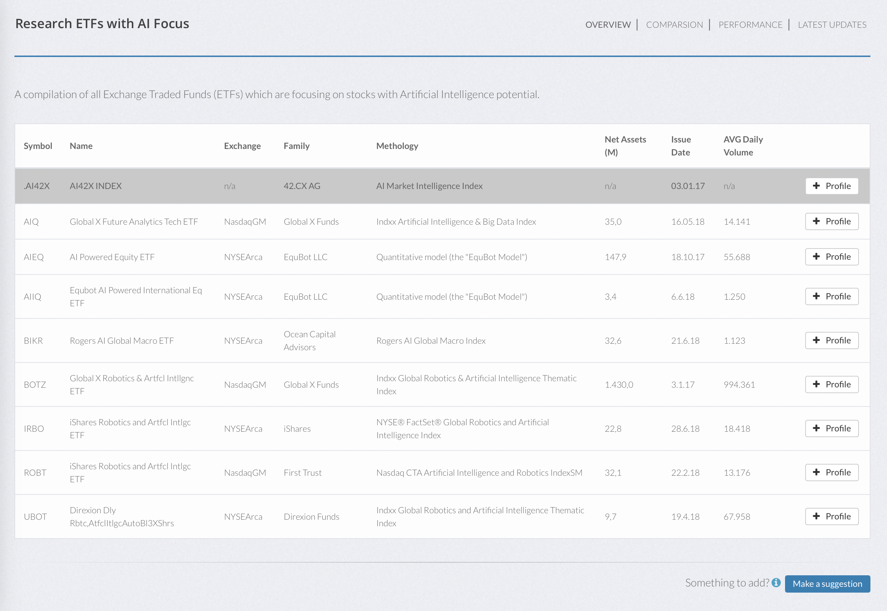

# Online AI Analyst: Introduction to Artificial Intelligence

Open Source implementation of an online analyst tool to research companies with competence in the area of Artificial Intelligence. Currently contains 11,469 public AI stocks, AI-ETF's and PE/VC backed AI companies with a focus on analytics of the core strength around AI technology. The system retrieves and collates data from multiple online sources and provides a comprehensive overview about the skills, expertise, finantial health, fitness and other parameters. Features include a compilation of all public listed companies which are specialised in or create real product value with Artificial Intelligence, a comprehensive compilation of private companies in the area of Artificial Intelligence and an overview of available Exchange Traded Funds (ETFs) with an investment focus in Artificial Intelligence companies. Funding rounds from major Venture Capital and Private Equity funds are matched with private companies in the database.

Here are some screenshots:

# Some of the Main Features

## Research Public AI companies

A compilation of all public listed companies which are specialised in or create real product value with Artificial Intelligence.

## Research Private AI companies

From start-up to unicorn - we cover them all. The most comprehensive compilation of private companies in the area of Artificial Intelligence.

## Research AI ETF's

An overview of available Exchange Traded Funds (ETFs) with an investment focus in Artificial Intelligence companies.

## The Top-100 Private AI Companies

Discover the Top-100 most promising private companies in the field of Artificial Intelligence.

## Latest VC funding rounds

Follow the capital and discover the latest funding rounds in private AI companies.

## The AI Unicorns

Unicorns are private companies valued above $1BN. Discover the AI companies which are in this category.

## Latest Series-A funded Companies

Discover private AI companies which just received their first funding milestone: Series-A.

## Public AI Companies: Top Gainers

Discover public traded companies with AI competence with the best preformance in the last 10 days.

## Private AI Companies: Top Gainers

Discover private AI companies with the best preformance in the last 90 days.

## Requirements

Webserver, PHP and Oracle MySQL.

## Installation

Copy all php files to a webserver directory of your choice. After installing the SQL script, the database is generated. Adjust the mysql connection settings in the code.

